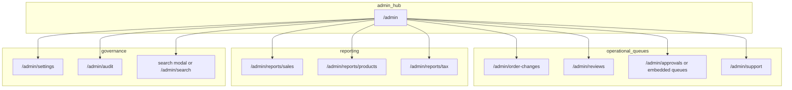

# Admin command center (PRD §26 + Manager parity)

## Context from the repo

- **[`apps/web/src/app/manager/page.tsx`](apps/web/src/app/manager/page.tsx)** is a **placeholder** (`SurfacePlaceholder`) describing intended manager workflows; there is **no separate manager UI to merge** beyond those bullets and PRD text.
- **[`apps/web/src/app/admin/page.tsx`](apps/web/src/app/admin/page.tsx)** is also a placeholder. Existing real admin UIs already live under **`/admin/order-changes`** and **`/admin/reviews`** ([`order-changes-client.tsx`](apps/web/src/app/admin/order-changes/order-changes-client.tsx), [`reviews-client.tsx`](apps/web/src/app/admin/reviews/reviews-client.tsx)), calling `/api/v1/admin/order-changes` and `/api/v1/admin/reviews`.
- **Backend:** [`RolesGuard`](apps/api/src/common/guards/roles.guard.ts) short-circuits **`user.role === "ADMIN"`** to `true`, so Admin can call endpoints tagged `MANAGER_OR_ADMIN` (e.g. [`reports.controller.ts`](apps/api/src/modules/reports/reports.controller.ts), [`locations.controller.ts`](apps/api/src/modules/locations/locations.controller.ts)) without an employee profile row.
- **Reports widgets** are already implemented server-side in [`reports.service.ts`](apps/api/src/modules/reports/reports.service.ts) (`getAdminWidgets`: active orders, sales today, clocked-in, drivers on delivery, low stock, tickets, catering count, open registers).
- **Gaps:** Empty Nest modules with **no HTTP surface** yet: [`employees.module.ts`](apps/api/src/modules/employees/employees.module.ts), [`catering.module.ts`](apps/api/src/modules/catering/catering.module.ts), [`register.module.ts`](apps/api/src/modules/register/register.module.ts). **Drivers** only expose [`GET drivers/available`](apps/api/src/modules/drivers/drivers.controller.ts) and [`POST drivers/:id/availability`](apps/api/src/modules/drivers/drivers.controller.ts)—no create/list driver profiles. **Catalog** is read-only ([`menu.controller.ts`](apps/api/src/modules/catalog/menu.controller.ts)). **Inventory** has DB models but **no inventory controller**.

---

## Product rule (locked)

- **One primary surface:** **`/admin`** (and **`/admin/*`** children). Do **not** build out `/manager` for now; any PRD “Manager” capability must be **reachable from Admin** for `ADMIN` users.
- **Admin ⊇ Manager:** Every action allowed for **STAFF+MANAGER** on shared endpoints must remain available to **`ADMIN`** (already true via `RolesGuard`); Admin-only actions (e.g. [`PATCH locations/settings`](apps/api/src/modules/locations/locations.controller.ts), [`admin.controller.ts`](apps/api/src/modules/admin/admin.controller.ts)) stay Admin-only.

---

## Information architecture

Use a **hub + sections** pattern so one mental model maps to PRD §26 and operations:

**Navigation:** Implement a small **Admin layout** (e.g. [`apps/web/src/app/admin/layout.tsx`](apps/web/src/app/admin/layout.tsx) — new) with links to existing and new routes, **`X-Location-Id`** via existing [`apiFetch` + `locationId`](apps/web/src/lib/api.ts) (same pattern as order-changes/reviews clients).

---

## Phase A — Admin home (highest user value, mostly frontend + thin API glue)

| Capability | Backend today | Admin work |
|------------|---------------|------------|
| §26.1 Dashboard widgets | `GET /api/v1/reports/widgets` | Replace placeholder [`admin/page.tsx`](apps/web/src/app/admin/page.tsx) with cards; poll or refresh; link each card to the right drill-down (e.g. low stock → future inventory page or placeholder). |
| Global search | `GET /api/v1/admin/search?q=` | Search UI + results grouped (orders / tickets / customers) with links to order/ticket surfaces. |
| Audit log | `GET /api/v1/admin/audit-log` | Paginated table (cursor). |
| Daily tax | `GET /api/v1/admin/reports/daily-tax?date=` | Date picker + summary display. |
| Sales dashboard | `GET /api/v1/reports/sales` | New route under `/admin/reports/...` with date range. |
| Product performance | `GET /api/v1/reports/products` | New route with range + tables. |
| Store settings | `GET` + `PATCH /api/v1/locations/settings` | Form: load settings; **PATCH is `ADMIN_ONLY`** — expose only for Admin session. |

**Embed existing pages:** Prominent links/cards from home to **[`/admin/order-changes`](apps/web/src/app/admin/order-changes/page.tsx)** and **[`/admin/reviews`](apps/web/src/app/admin/reviews/page.tsx)** so the hub is complete.

---

## Phase B — Approval queues (KDS/chat cancellation + refunds)

**Problem:** [`admin.controller.ts`](apps/api/src/modules/admin/admin.controller.ts) exposes **`POST .../cancellation-requests/:id/decide`** and **`POST .../refund-requests/:id/decide`** but there is **no list endpoint** in that controller for pending items. Admins cannot discover IDs from the UI without search/global hunt.

**Required backend (small, high leverage):**

- `GET /api/v1/admin/cancellation-requests?status=PENDING` (location-scoped)
- `GET /api/v1/admin/refund-requests?status=PENDING` (or equivalent statuses your schema uses)

Implement list serializers in [`admin.service.ts`](apps/api/src/modules/admin/admin.service.ts) + wire routes on [`admin.controller.ts`](apps/api/src/modules/admin/admin.controller.ts).

**Admin UI:** New route e.g. **`/admin/approvals`** (or two tabs on home) with tables, row actions calling existing `POST` decide endpoints, notes fields aligned with DTOs (`DecideCancellationDto`, `DecideRefundDto`).

**Related:** KDS already has operational endpoints under **`/api/v1/kds/...`** ([`kds.controller.ts`](apps/api/src/modules/kds/kds.controller.ts)) including **`/pin/bypass`** and **`/pin/regenerate`** (**`@Roles("ADMIN")`**). The admin surface should **link or embed** order-scoped actions (open order from search → actions panel calling `kds` routes)—no need to duplicate business logic if order context is clear.

---

## Phase C — Support queue (Manager/Admin parity)

**Backend today:** [`support.controller.ts`](apps/api/src/modules/support/support.controller.ts) — list/get/messages/status/resolve for `STAFF` and `ADMIN`.

**Admin UI:** **`/admin/support`** — ticket list (reuse query params from `list`), detail view, internal notes, status transitions. This satisfies PRD “support queues” alongside widget counts.

---

## Phase D — Direct financial / order actions (Admin-only APIs already exist)

From order context (search or order detail):

- **`POST /api/v1/admin/orders/:id/cancel`** — direct cancel with reason ([`CancelOrderDto`](apps/api/src/modules/admin/admin.controller.ts)).
- **`POST /api/v1/admin/customers/:id/credit`** — store credit ([`CreditCustomerDto`](apps/api/src/modules/admin/admin.controller.ts)).

**Dependency:** You need a **staff-facing order detail** that exposes customer id and order id, or build minimal panels on Admin that accept pasted UUIDs (interim). Prefer linking to an existing internal order page if the repo has one; otherwise add a thin **`/admin/orders/[id]`** shell that loads order via [`orders.controller.ts`](apps/api/src/modules/orders/orders.controller.ts) and shows action buttons.

---

## Phase E — PRD §26 “complete” vs “future” (larger backend builds)

These are called out in **[`Docs/procedures/issues/prd_point_26_plan.md`](Docs/procedures/issues/prd_point_26_plan.md)** and still apply:

| PRD theme | Blocker |
|-----------|---------|
| **CSV exports** (§26.7) | Add export endpoints or server-streamed CSV per list (reports, audit, support). |
| **Permissions matrix UI** (§26.4) | No API for `admin_location_assignments` / employee role admin; schema exists ([`DriverProfile`](packages/database/prisma/schema.prisma) ties to `EmployeeProfile`). |
| **Inventory operations** | No `inventory` module; widgets query raw SQL in [`reports.service.ts`](apps/api/src/modules/reports/reports.service.ts) only. |
| **Catering inquiry management** | [`CateringModule`](apps/api/src/modules/catering/catering.module.ts) empty; `CateringInquiry` exists in Prisma; widget counts pending inquiries but **no CRUD API**. |
| **Register / drawer** | [`RegisterModule`](apps/api/src/modules/register/register.module.ts) empty; web [`register/page.tsx`](apps/web/src/app/register/page.tsx) is placeholder. |
| **Employee administration** | [`EmployeesModule`](apps/api/src/modules/employees/employees.module.ts) empty. |
| **Catalog edits** (items, pricing, availability) | Catalog API is **GET-only**; needs write endpoints + audit. |
| **Driver “add driver”** | [`drivers.controller.ts`](apps/api/src/modules/drivers/drivers.controller.ts) has no create. Schema: `DriverProfile` requires `EmployeeProfile` + `User`; needs **staff onboarding** flow (create user, employee row `DRIVER`, `DriverProfile`)—likely **`auth` + `employees` + `drivers`** collaboration. |

**Ordering recommendation:** Finish **A → B → C → D** (hub, approvals listing, support, order tools) before investing in **E** modules—unless inventory or catering is business-critical sooner.

---

## Testing / acceptance (lightweight)

- API e2e or integration tests for **new list endpoints** (pending cancellation/refund).
- Smoke: Admin session can load widgets, search, audit, settings PATCH, and approval actions return expected envelopes.

---

## Summary: “What else must be created?”

Beyond the Admin UI shell, the **minimum new backend** for a credible Admin experience is: **pending cancellation list**, **pending refund list**, and optionally **order detail route** for wiring cancel/credit/KDS admin tools. Everything else in the dependency table is **additional modules** (inventory, catering, employees, drivers onboarding, register, catalog writes) that the Admin hub can **link to as “coming soon”** until those APIs exist.
