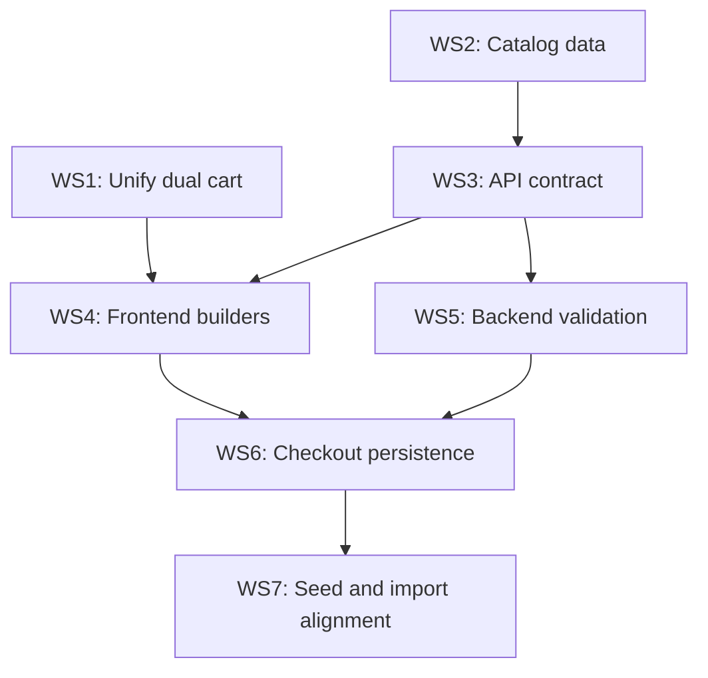

# Time-Gated Lunch Specials, Real Builders, and Catalog Customization

## Architecture overview

---

## WS1. Unify the dual cart into one system

Two independent cart contexts exist and are never synchronized:

- **Wings4u cart** (`[Wings4u/cart-context.tsx](apps/web/src/Wings4u/cart-context.tsx)`) -- simple `{id, name, price, qty}`, drives navbar badge and cart drawer.
- **Lib cart** (`[lib/cart.ts](apps/web/src/lib/cart.ts)`) -- rich `{menu_item_id, modifier_selections, special_instructions, quantity}`, drives `ItemModal` and checkout.

**Delete the Wings4u cart entirely.** Replace all references with the lib cart:

- Delete `[Wings4u/cart-context.tsx](apps/web/src/Wings4u/cart-context.tsx)`.
- Remove `CartItem` and `MenuItem` from `[Wings4u/types.ts](apps/web/src/wingkings/types.ts)`.
- In `[Wings4u/components/menu-page.tsx](apps/web/src/Wings4u/components/menu-page.tsx)`: replace `useWings4uCart()` with `useCart()` from `@/lib/cart`. Every card click now opens a modal (so special instructions are always available).
- Remove `Wings4uCartProvider` from the shell component.
- Navbar badge: switch from `useWings4uCart().cartCount` to `useCart().itemCount`.
- Cart drawer/page: switch to lib cart's `items` array.

---

## WS2. Catalog data changes

### 2a. Party Specials category

New category `Party Specials` (slug `party-specials`) immediately after `Specials`:

- `75 Wings - up to 5 flavours` -- $89.99 (8999 cents), `builder_type: "WINGS"`
- `100 Wings - up to 5 flavours` -- $116.99 (11699 cents), `builder_type: "WINGS"`

Simplified builder: wing type, preparation, up to 5 flavours, no saucing-method wizard.

### 2b. "No Flavour (Plain)" wing flavour

Add to `wing_flavours`: `name = "No Flavour (Plain)"`, `heat_level = "PLAIN"`, `is_plain = true`, `sort_order = 0`.

### 2c. Lunch-special schedules

For every `lunch-specials` item, create 7 `menu_item_schedules` rows (one per day):

- `time_from: 11:00:00`, `time_to: 15:00:00`

### 2d. Chicken Nuggets

Add to `poutines-sides`: one `Chicken Nuggets` item with a required `SINGLE` size modifier group (`6pc` / `12pc`). Prices TBD from existing menu data.

### 2e. Consolidated size items

One menu item per base product with a required `SINGLE` size modifier group:

- Poutines: `Small` / `Large` options
- Garlic Bread variants: `4pc` / `8pc` options per variant
- Chicken Nuggets: `6pc` / `12pc` as above

### 2f. Appetizer data (complete)

Replace `appetizers-extras` items with the full real menu:

| Item                       | Price  | Description                                                                                                                                                |
| -------------------------- | ------ | ---------------------------------------------------------------------------------------------------------------------------------------------------------- |
| Mac n Cheese Bites (8pc.)  | $7.99  | served with ranch                                                                                                                                          |
| Mozzarella Sticks (8pc.)   | $10.49 | served with salsa                                                                                                                                          |
| Cheddar Cheese Cubes       | $9.49  | served with ranch                                                                                                                                          |
| Jalapeno Poppers (6pc.)    | $9.49  | served with ranch                                                                                                                                          |
| Cauliflower Bites          | $9.49  | served with ranch                                                                                                                                          |
| Breaded Pickle Spears      | $9.49  | served with ranch                                                                                                                                          |
| Sweet Potato Fries         | $9.49  | served with chipotle sauce                                                                                                                                 |
| Battered Mushroom Caps     | $9.49  | served with ranch                                                                                                                                          |
| Breaded Popcorn Chicken    | $9.49  | served with plum sauce                                                                                                                                     |
| Loaded Potato Skins (4pc.) | $9.49  | served with sour cream                                                                                                                                     |
| Vegetable Samosa           | $1.00  | served with thai sauce                                                                                                                                     |
| Veg. Samosa Poutine        | $10.99 | made with our signature sauce                                                                                                                              |
| Spinach Dip                | $14.99 | --                                                                                                                                                         |
| Chicken Loaded Fries       | $11.99 | Fries, tomato, red onion, blend cheese, freshly breaded chicken drizzled with sweet chili sauce, ranch, house seasoning and served with sour cream on side |
| Bacon Loaded Fries         | $11.99 | Fries, tomato, red onion, blend cheese, bacon, drizzled with sweet chili sauce, ranch, house seasoning and served with sour cream on side                  |

### 2g. Drink consolidation

`Pop` becomes one item with required `SINGLE` modifier group: `Coke`, `Diet Coke`, `Dew`. `Water` and `Energy Drink` remain standalone.

---

## WS3. API contract and type expansion

### 3a. `/menu` response additions

In `[catalog.service.ts](apps/api/src/modules/catalog/catalog.service.ts)`, add to each menu item:

- `builder_meta: BuilderMeta | null` -- computed at query time from modifier groups and `context_key` values (not a DB column). For `WINGS`/`WING_COMBO`: locked size label, group IDs for wing type/preparation/flavours/sides/drinks, max flavour count, extra flavour price.
- `schedules: ItemSchedule[] | null` -- from `menu_item_schedules` rows.
- `requires_special_instructions: boolean` -- from existing DB column.

### 3b. Modifier option `linked_flavour_id`

Expose `linked_flavour_id: string | null` on each option in `/menu`. Already in DB, just not serialized.

### 3c. Schedule-based visibility filtering

In `getMenu()`: if a menu item has schedule rows, check current store time (location timezone). Exclude items outside all active windows. Hides lunch specials outside 11 AM - 3 PM.

### 3d. Cart/checkout item payload expansion

Expand `CartItemDto` with optional `builder_payload`:

- `wing_type`, `preparation`, `weight_lb`
- `flavour_slots[]` with `slot_no`, `wing_flavour_id`, `placement`
- `saucing_method` (when 2+ flavours)
- `extra_flavour` (optional)
- `side_selections[]`, `drink_selections[]` (combo only)

### 3e. Lunch-special error shape

Structured `SCHEDULE_VIOLATION` error with `affected_item_ids` and `schedule_window`, so the frontend can show a "remove all lunch specials" dialog.

### 3f. Client-side type updates

In `[lib/types.ts](apps/web/src/lib/types.ts)`: add `BuilderMeta`, `ItemSchedule`, `WingFlavour`, `WingBuilderPayload`; expand `MenuItem`, `ModifierOption`, `CartItem`.

---

## WS4. Frontend builders

### 4a. Every item opens a modal

After WS1, every card click opens a modal. Items with no modifiers get a lightweight "quick add" with quantity + special instructions + add button.

### 4b. Lunch-special popup

Just the generic `ItemModal` -- pop choice comes from the modifier group data. Schedule enforcement: API hides items outside the window; if items are in cart and quote/checkout fails with `SCHEDULE_VIOLATION`, show a blocking dialog with "Remove lunch specials" button.

### 4c. Wing builder modal

New component: `apps/web/src/wingkings/components/wing-builder.tsx`

Opens when `builder_type === "WINGS"` or `"WING_COMBO"`. Vertical scrollable form with steps:

1. Wing Type (bone-in / boneless)
2. Preparation (breaded / non-breaded; breaded disabled when boneless)
3. Size (locked read-only badge from the clicked card)
4. Flavour slots (count by weight; grouped by heat category; "No Flavour (Plain)" first)
5. Saucing Method (shown when 2+ flavours; defaults: MIXED for 2, ALL_MIXED for 3)
6. Extra Flavour (+$1.00 toggle with additional slot)
7. Combo extras (WING_COMBO only: side + drink slots)
8. Suggested Add-ons (optional modifier groups)
9. Special Instructions textarea

**Sticky bottom bar**: quantity selector, running total, add-to-cart button. On invalid submit: auto-scroll to first missing required step with red pulse highlight.

**Party Specials**: same component, `max_flavours = 5`, no saucing method, no combo extras.

### 4d. Generic modal enhancements

- Size modifier groups (`context_key = "size"`) render as prominent pill buttons.
- Add sticky bottom bar (quantity + total + add button).

---

## WS5. Backend validation

### 5a. Modifier integrity

In `[cart.service.ts](apps/api/src/modules/cart/cart.service.ts)` and `[checkout.service.ts](apps/api/src/modules/checkout/checkout.service.ts)`: validate selected options belong to the item's modifier groups and satisfy `min_select`/`max_select`/`selection_mode`.

### 5b. Schedule enforcement

Check `menu_item_schedules` against effective order time (`scheduled_for` or current store time). Reject with `SCHEDULE_VIOLATION`.

### 5c. Builder payload validation

- Wing type / preparation enum values
- Boneless must be non-breaded
- Weight matches allowed values
- Flavour count matches `required_flavour_count` for weight
- Flavour IDs reference active wing flavours
- Saucing method required when 2+ flavours
- Combo side/drink slot counts match tier
- Weight in payload matches the menu item's implied weight (locked size)

### 5d. Special instructions enforcement

Reject lines where `requires_special_instructions = true` and instructions are empty.

---

## WS6. Checkout persistence for builder items

In `[checkout.service.ts](apps/api/src/modules/checkout/checkout.service.ts)`, after creating `OrderItem` for wing/combo lines:

- Write `OrderItemWingConfig` from builder payload fields.
- Write `OrderItemFlavour` rows (one per slot + extra).
- Store full `builder_payload` as `builder_payload_json` on the order item.
- Continue writing `OrderItemModifier` rows for pricing-affecting selections (sides, drinks, extra flavour surcharge).

Wing orders persist in both normalized wing tables (for KDS) and generic modifier table (for pricing).

---

## WS7. Seed and import alignment

Both `[seed.ts](packages/database/prisma/seed.ts)` and `[import-menu.ts](packages/database/prisma/import-menu.ts)` must produce the same catalog shape:

- Party Specials category + 2 items
- "No Flavour (Plain)" wing flavour
- `menu_item_schedules` for lunch specials
- Consolidated poutines, garlic breads, nuggets with size modifier groups
- Chicken Nuggets in poutines-sides
- Pop consolidation with Coke/Diet Coke/Dew modifier group
- Full appetizer list (15 items with descriptions)
- Menu JSON (`[wings4u-menu.v1.json](Docs/menu/wings4u-menu.v1.json)`) updated with all new structures

---

## File change summary

- **Delete**: `wingkings/cart-context.tsx`
- **New**: `wingkings/components/wing-builder.tsx`
- **Major edits**: `menu-page.tsx`, `catalog.service.ts`, `cart.service.ts`, `checkout.service.ts`, `lib/types.ts`, `lib/cart.ts`, `item-modal.tsx`, `seed.ts`, `import-menu.ts`, `wings4u-menu.v1.json`
- **Minor edits**: `wingkings/types.ts`, `wingkings/shell.tsx`, cart/checkout controllers, `globals.css` / `global-style.tsx`, `extract-menu-docx.ts`

