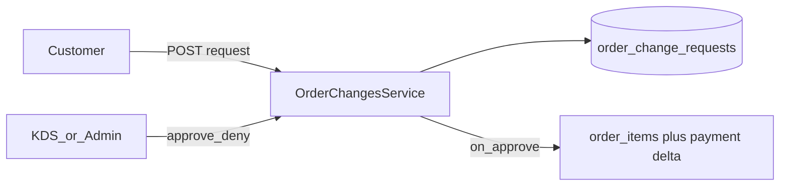
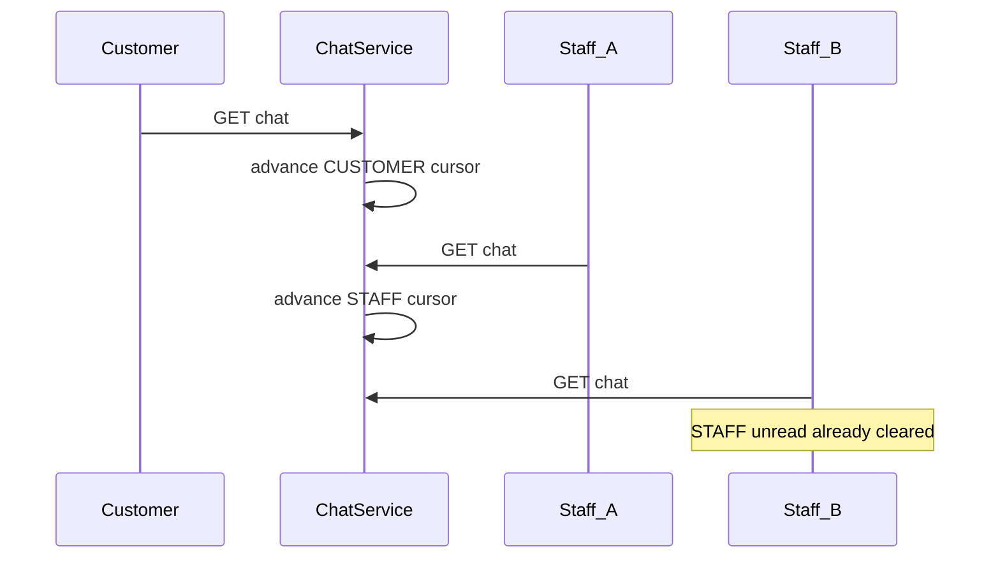

# PRD Point 13,14,15 Plan

Last updated: 2026-04-12

## Requested Wording (verbatim)

PRD §13, §14, §15 — detailed implementation plan

Sources: Your pasted §14 text (Reviews & Admin Replies). §13 and §15 are anchored from the canonical baseline comment in db/sql/0001_wings4u_baseline_v1_4.sql (order_change_requests → PRD §10.12 + §13; chat_side_read_states → §15). The PRD .docx is not machine-readable here; if §13/§15 subsection numbers differ in the PDF, treat this plan as requirement-accurate to those SQL/Prisma contracts.

§13 — Post-order changes (“add items after ordering”)

Intent (from schema): Customers (or staff on behalf) request ADD_ITEMS changes; store records in order_change_requests with requested_items_json, PENDING → APPROVED / REJECTED.

Current state

- Table + Prisma model: packages/database/prisma/schema.prisma — OrderChangeRequest, enum ChangeRequestType { ADD_ITEMS }, ChangeRequestStatus.
- API: apps/api/src/modules/order-changes/order-changes.module.ts is an empty stub (no controller/service).

Backend work (ordered)

- Service layer — OrderChangesService:
- Create request: POST /orders/:orderId/change-requests (customer): body = structured line items (mirror checkout line shape or minimal SKU + qty + modifiers). Validate:
- Caller owns order (customer_user_id).
- Order status allows changes (define explicitly—typically ACCEPTED / PREPARING per PRD; reject CANCELLED, terminal delivery/pickup completed, etc.).
- Re-run same validation as checkout for each requested line (menu availability, schedules, modifiers, archived, fulfillment).
- List pending/history for order (customer + staff).
- Staff approve/deny (KDS or admin): update status, resolved_by_user_id, resolved_at, rejection_reason / note.
- On approve: append new order_items (and modifiers/flavours) inside a transaction; recompute pricing deltas; create order_payments row or payment intent for delta; emit order_status_events / realtime as needed.
- Controller + DTOs — Nest guards: CUSTOMER for create; KITCHEN/MANAGER/ADMIN for approve (align with existing KDS permission patterns in kds.service.ts).
- Contract — Extend Docs/Wings4U_API_Contract_v1_0.md (and Docs/API_Spec/ copy) with request/response shapes and error codes.
- E2E — apps/api/test/app.e2e-spec.ts: happy path create → approve → line appears + payment delta; reject path; forbidden when order terminal.

Web work

- My Orders → Past Orders (or active order detail): CTA “Request add-on” when PRD allows; item picker → POST change-request.
- KDS / Admin: queue of pending order_change_requests with approve/deny (could be a panel on existing KDS board or admin).

Risks / decisions to lock early

- When changes are allowed (status + time window) must match PRD §10.12 prose—implement as explicit allowlist in code.
- Payment: card AUTH/CAPTURE rules from Wings4U_API_Contract_v1_0.md §13 Cross-Cutting Rules for delta charges.

PRD §14 — Reviews & Admin Replies (your specification)

Requirements (verbatim themes)

- 14.1 Eligibility: Review only if order status is PICKED_UP or DELIVERED. Not NO_SHOW_*, not CANCELLED.
- 14.2 Customer flow: Per order line (order_item_id), not whole order only; multiple items → pick item then rate; 1–5 stars + optional text; one review per order_item (unique).
- 14.3 Admin reply: Admin replies from panel; store admin_reply, admin_replied_at, admin_replied_by_user_id; customer-visible; internal by default; public only if owner publishes (is_approved_public in schema maps to this).

Current state

- Schema ItemReview already has: rating, review_body, is_approved_public, admin_reply, admin_replied_at, admin_replied_by_user_id, @@unique([orderItemId, customerUserId]).
- ReviewsModule is empty — no HTTP surface.

Backend work

- ReviewsService
- POST /orders/:orderId/reviews or POST /order-items/:orderItemId/reviews: validate eligibility (order status ∈ {PICKED_UP,DELIVERED}); order_item belongs to order and customer; rating 1–5; upsert blocked if review exists (unique constraint).
- GET /orders/:orderId/reviews (customer): list reviews for that order’s lines (for “Reviews tab”).
- PATCH /admin/reviews/:id (admin): set admin_reply, admin_replied_at, admin_replied_by_user_id.
- Optional: PATCH /reviews/:id/publish (customer or admin per PRD) toggles is_approved_public.
- Guards — Customer-only for create; admin role for reply; optional manager read-only.
- Contract + E2E — Eligibility matrix (negative tests for CANCELLED, NO_SHOW_*); unique constraint violation; admin reply round-trip.

Web work

- Past Orders → Reviews tab: list order items eligible for review; star + text UI; show admin reply when present; publish toggle if customer-controlled.

Schema note: Unique key is (orderItemId, customerUserId) — matches “one review per line per customer.” If PRD strictly requires uniqueness on order_item_id alone, confirm (multi-customer same line is impossible for one order).

PRD §15 — Chat unread (canonical side-based model)

Intent (from baseline SQL comment): chat_side_read_states — reader_side ∈ CUSTOMER | STAFF; any staff read advances STAFF cursor for all staff; chat_read_states is non-canonical audit.

Current state

- Implemented in apps/api/src/modules/chat/chat.service.ts (chatSideReadState upsert/read).
- API contract Wings4U_API_Contract_v1_0.md §5 documents unread behavior on GET/POST chat.

Remaining work (verification / hardening, not greenfield)

- Trace matrix: For each path (GET messages, POST send, POST read), confirm STAFF vs CUSTOMER cursor updates match PRD §15.
- Realtime: Ensure chat.read events when cursor advances (already partially wired per earlier work).
- E2E: Extend chat tests to assert chat_side_read_states rows after customer vs staff read (if not already covered).
- Web: Unread badge on order list / chat icon uses server-derived unread if exposed; otherwise add API field on GET /orders or chat metadata.

Suggested implementation order

- §15 — Short audit + tests (low risk; mostly validation).
- §14 — Item reviews API + customer/admin UI (medium; schema ready).
- §13 — Order change requests (highest complexity: pricing, payments, KDS workflow).

## Quick Summary

This note captures the PRD section 13, section 14, and section 15 implementation backlog as a current issue-plan note.

In plain English, the work breaks into three tracks:

1. post-order add-item change requests
2. item-level reviews plus admin replies
3. chat unread verification and hardening

This file preserves your exact requested wording above and then restates the same scope in the repo’s issue-note format below.

---

## Purpose

This note explains:

1. what PRD section 13, section 14, and section 15 require
2. what the repo already has in schema or partial implementation
3. what still needs to be built or verified
4. what order the implementation should follow

This is a planning note, not a fix/archive note.

---

## How To Read This Note

If you want the short version, read:

- `Quick Summary`
- `Problem In Plain English`
- `What Was Found`
- `What Still Needs To Be Fixed`
- `Final Plain-English Summary`

If you want the implementation view, read the whole note from top to bottom.

---

## Problem In Plain English

The schema already shows that the product expects:

- customers to request post-order additions
- customers to review individual order lines
- admins to reply to reviews
- chat unread to be tracked by side, not only by individual user

But large parts of the runtime surface are still missing.

So this is not a schema-design task.

It is an implementation and validation task:

- section 13 is mostly unbuilt
- section 14 has schema but no HTTP/UI surface
- section 15 exists but still needs a trace audit, tests, and possibly small API/UI follow-through

---

## Technical Path / Files Involved

The main files and modules named or implied by this plan are:

- [`packages/database/prisma/schema.prisma`](../../../packages/database/prisma/schema.prisma)
- [`apps/api/src/modules/order-changes/order-changes.module.ts`](../../../apps/api/src/modules/order-changes/order-changes.module.ts)
- [`apps/api/src/modules/chat/chat.service.ts`](../../../apps/api/src/modules/chat/chat.service.ts)
- [`apps/api/src/modules/kds/kds.service.ts`](../../../apps/api/src/modules/kds/kds.service.ts)
- [`apps/api/test/app.e2e-spec.ts`](../../../apps/api/test/app.e2e-spec.ts)
- `Docs/Wings4U_API_Contract_v1_0.md`
- `Docs/API_Spec/`

Likely new files if implemented:

- `order-changes.controller.ts`
- `order-changes.service.ts`
- DTO files for section 13 and section 14
- review module/controller/service files
- web order-detail / past-orders review UI
- KDS/admin review and change-request surfaces

---

## Why This Mattered

These sections affect the post-checkout lifecycle, not just the menu.

If they are left incomplete:

- customers cannot request legitimate add-on changes after placing an order
- stores cannot approve/deny those requests in a structured workflow
- item reviews and admin replies stay unavailable even though the schema already supports them
- chat unread behavior can drift away from the intended side-based model without tests catching it

This affects customer experience, KDS/admin workflow, and support/read-state correctness.

---

## What Was Found

### Section 13 baseline

The schema already contains the core storage model:

- `OrderChangeRequest`
- `ChangeRequestType`
- `ChangeRequestStatus`

But the API module is effectively empty right now, so the actual feature is not yet surfaced.

### Section 14 baseline

The schema is also largely ready for reviews:

- rating
- review body
- public/publish flag
- admin reply fields
- uniqueness per order item and customer

But the reviews module is still only a shell and no real customer/admin flow exists yet.

### Section 15 baseline

The canonical side-based unread model is already implemented in chat service:

- `chat_side_read_states`
- `chat_read_states` as supporting audit

So section 15 is not greenfield.

The work there is mainly:

- trace validation
- stronger tests
- making sure any web unread badge uses the correct server-derived state

---

## What Still Needs To Be Fixed

### Section 15

1. Audit every chat path against the side-based unread contract.
2. Confirm `chat.read` realtime behavior when the cursor advances.
3. Add E2E coverage for customer-side vs staff-side read advancement.
4. Add unread metadata to list APIs or web chat surfaces if the current contract is not enough for badges.

### Section 14

1. Build review create/list flows at the order-item level.
2. Enforce the eligibility matrix:
   only `PICKED_UP` and `DELIVERED`, never `CANCELLED` or `NO_SHOW_*`.
3. Add admin reply editing.
4. Decide whether publish control is customer-side, admin-side, or both.
5. Add E2E coverage for eligibility, uniqueness, and reply round-trip.
6. Build the customer Past Orders review tab and the admin reply surface.

### Section 13

1. Build `OrderChangesService` and controller/DTOs.
2. Define the exact allowed status window for add-item requests as an explicit code allowlist.
3. Reuse checkout-grade validation for requested lines.
4. Build approve/deny flows for KDS/admin.
5. On approval, append order items transactionally and compute payment deltas safely.
6. Extend the API contract docs and add E2E coverage.
7. Add customer and staff UI surfaces for request creation and approval queues.

---

## Risks / Decisions To Lock Early

The plan already highlights the decisions that should be fixed early because they affect architecture:

1. Section 13 allowed-status window
   The exact order statuses that permit add-item requests must be locked in code from the PRD, not guessed ad hoc.

2. Section 13 payment delta behavior
   Delta-charge behavior must follow the existing contract rules for card/capture handling.

3. Section 14 publish ownership
   The schema supports publish state, but product/control ownership still needs to be made explicit in implementation.

4. Section 15 unread source of truth
   Any web unread badge must use the canonical side-based model, not drift into ad hoc local computation.

---

## Expected Files To Change

If this plan is implemented, the likely change set will include:

- schema-adjacent contract/docs files
- new section 13 service/controller/DTO files
- new section 14 service/controller/DTO files
- chat tests and maybe small chat metadata changes
- KDS/admin UI files
- customer order-detail / past-orders UI files
- API contract docs and mirrored spec copies

The biggest backend complexity is expected in section 13 because it touches validation, pricing, payment deltas, and realtime/order lifecycle updates.

---

## Verification Targets

The acceptance-style checks implied by this plan are:

- section 15:
  chat side unread moves correctly for customer vs any staff reader
- section 14:
  eligible lines can be reviewed once, ineligible lines cannot, and admin replies round-trip
- section 13:
  a change request can be created, approved or denied, and approved changes append real order lines with the correct payment delta

These should be covered in API E2E plus targeted web/manual checks for the UI surfaces.

---

## Status

Status: open planning backlog

The repo has useful schema groundwork for all three sections, and chat already has partial runtime behavior for section 15, but the end-to-end product implementation is still incomplete.

---

## Final Plain-English Summary

This file now does two things:

1. preserves your exact PRD section 13 / 14 / 15 wording so the requested implementation scope is not lost
2. restates that scope in the repo’s standard issue-note structure so it can be tracked and later paired with a fix note

The recommended order remains:

- section 15 first because it is mostly verification and hardening
- section 14 second because the schema is ready and the API/UI work is medium complexity
- section 13 last because it is the deepest workflow with validation, pricing, and payment implications

## Gap Analysis Findings (Appended 2026-04-13)

Following the implementation, an audit produced the following gap analysis. The analysis is presented here to preserve context on what remains to be addressed.

### The Findings 
| # | Severity | Section | Finding | Status |
|---|---|---|---|---|
| 1 | 🔴 Critical | §13 | No payment intent/row for card delta | ⏭️ Skipped (Payment not live - tracked in `future_fixes.md`) |
| 2 | 🔴 Critical | §13 | Server validation doesn't mirror checkout | ⚠️ Pending (Schedule/fulfillment/builder validation) |
| 3 | 🟡 Medium | §15 | No unread badge on orders list | ⚠️ Pending |
| 4 | 🟡 Medium | §14 | Publish decision undocumented | ⚠️ Pending (Admin-only decision not in docs) |
| 5 | 🟡 Medium | §13 | KDS not integrated with change requests | ⚠️ Pending (No KDS pending indicator) |
| 6 | 🟡 Medium | §13 | No audit trail rows for changes | ⚠️ Pending (Missing `orderStatusEvent` for approval/reject) |
| 7 | 🟢 Low | §13 | Flavour snapshots not handled | ⚠️ Pending (Mitigated by UI) |
| 8 | 🟢 Low | §13/14 | API_Spec mirror not verified | ⚠️ Pending |
| 9 | 🟢 Low | §13 | Silent parse drops malformed items | ⚠️ Pending |

### Remediation Plan

#### Phase 1 — Critical Fixes (§13 validation)
- **1a. Payment intent (Finding 1):** Skipped for now, deferred to `future_fixes.md`.
- **1b. Mirror checkout validation (Finding 2):** Add server-side checks in `approveChangeRequest()` for schedule, fulfillment type, builder type, and modifier rules.
- **1c. Strict parsing (Finding 9):** Block malformed add-item requests rather than silently parsing them.

#### Phase 2 — Medium Fixes (§13/§14/§15 completeness)
- **2a. Audit trail rows (Finding 6):** Create `orderStatusEvent` rows during `approveChangeRequest()` and `rejectChangeRequest()`.
- **2b. KDS indicator (Finding 5):** Subscribe to `order.change_requested` on the KDS board and display a pending badge.
- **2c. Unread badge (Finding 3):** Expose `unread_chat_count` and display unread dot/badge on the customer orders list UI.
- **2d. Document publish decision (Finding 4):** State explicitly in docs/fix note that publish toggle is admin-only.

#### Phase 3 — Low Priority Polish
- **Finding 7:** Add server-side backend rejection for builder-type item modifications.
- **Finding 8:** Ensure `Docs/API_Spec/` mirror (if used) is synced.
