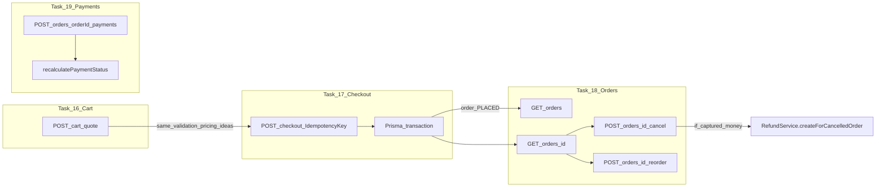

# PRD Point 17,18,19 Plan

Last updated: 2026-04-13

## Requested Wording (verbatim)

Plan: Tasks 17, 18, 19 (with Task 16 as upstream matrix)

Source of truth for numbering

Roadmap items 16–19 are defined in Docs/procedures/tasks.md (sections 16. Cart service… through 19. Payments service). All four are marked [x] complete at the task-list level; this plan describes what was built, how it chains together, and what to verify or extend next.

Task 16 — matrix / workflow role (context for 17–19)

Intent (tasks.md): POST cart/quote (apps/api/src/modules/cart/cart.service.ts) validates lines against live menu data and computes totals (tax, delivery rules, etc.) without persisting an order.

Why it matters for 17–19: Checkout must not silently diverge from quote rules. Any rule enforced at quote time (archived items, schedules, fulfillment, modifiers, delivery zone, lead time, wallet math) should have a matching server path in checkout.service.ts. PRD §8 QA coverage is documented in Docs/audits/prd-section-8-qa-matrix.md.



Task 17 — Checkout service (idempotency + order creation)

Scope (from tasks.md)

- `placeOrder()` inside a Prisma transaction: idempotency via `checkout_idempotency_keys`, validation, pricing, nested order + line items, initial status `PLACED`, `cancel_allowed_until` (~2 minutes from placement).
- Idempotent replay: same `Idempotency-Key` returns the existing order (no duplicate).
- Order number: monotonic per location.
- Pricing snapshot on the order for audit.
- API: `POST /checkout` with `@Roles("CUSTOMER")`, required `Idempotency-Key` header, profile-complete gate, `location_id` matches `X-Location-Id`.

Implementation anchors (verify against tasks.md bullets)

| Concern | Where to look |
|---|---|
| Transaction boundary + idempotency | `checkout.service.ts` `placeOrder` |
| Wallet atomicity (§8) | Same file: `SELECT ... FOR UPDATE` on `customer_wallets` inside the transaction before/around order create |
| Self-cancel window seed | `cancelAllowedUntil` set at order create (2 min) |
| Controller contract | `checkout.controller.ts` |

Known PRD follow-up (not blocking “task 17 done”)

- Promo inside `placeOrder`: still deferred repo-wide; QA matrix and `prd-section-8-qa-matrix.md` call this out. When added, redemption must be transactional with order creation.

Verification checklist

- `npm run build:api`
- E2E in `apps/api/test/app.e2e-spec.ts`: archived main/salad, postal, lead time, wallet concurrency (per QA matrix)
- Manual: cart quote total for a fixture cart ≈ checkout `final_payable_cents` for same payload (spot-check)

Task 18 — Orders service (pagination + cancellation + reorder)

Scope (from tasks.md)

- `listOrders`: cursor pagination; role-aware (customer vs staff).
- `getOrderDetail`: full order with items/modifiers/events; ownership rules.
- Cancellation: customer path for early lifecycle; `POST /orders/:id/cancel` (`orders.controller.ts`).
- Extras in repo (beyond minimal tasks.md line): reorder, delivery-pin PRD routes — treat as part of the orders surface for planning.

Implementation anchors

| Concern | Where to look |
|---|---|
| List/detail | `orders.service.ts` |
| Self-cancel §12.1: fixed reason, window enforcement | `customerCancel` — fixed `SELF_CANCEL_DEFAULT_REASON`, `cancelAllowedUntil` check, `CUSTOMER_SELF` |
| Chat close on cancel | `chatService.closeConversation(orderId)` after cancel |
| Auto `refund_request` §12.6 | `refundService.createForCancelledOrder` after customer cancel |
| Reorder rules §7 | `reorder()` in same service |

Relationship to Task 19

- Customer cancel does not call `PaymentsService` directly; it calls `RefundService.createForCancelledOrder`, which depends on net captured money inferred from `order_payments` (and related rules). Task 19 supplies the ledger rows that make that calculation meaningful.

Verification checklist

- E2E: customer self-cancel with `SUCCESS` capture → one `PENDING` `refund_request` (documented in `prd-section-8-qa-matrix.md` follow-up)
- E2E: chat closed after approved cancels (same doc)

Task 19 — Payments service (order payment rows + status rollup)

Scope (from tasks.md)

- `createPayment`: append `order_payments` with `transaction_status: SUCCESS`, then recalculate `orders.payment_status_summary` (`UNPAID` → `AUTHORIZED` → `PAID` → `REFUNDED`, etc.).
- `getPaymentsForOrder`: list payments for an order.
- API: `POST /orders/:orderId/payments` STAFF/ADMIN; GET for owner or staff (`payments.controller.ts`).

Implementation anchors

| Concern | Where to look |
|---|---|
| Row insert + rollup | `payments.service.ts` `createPayment`, `recalculatePaymentStatus` |
| Transaction types | `AUTH`, `CAPTURE`, `VOID`, `REFUND`, `ADJUSTMENT` aggregation loop |

Cross-links

- Refunds module (task 21 in tasks.md) consumes payment/refund state; E2E often seeds `order_payments` to simulate capture before cancel.
- POS (task 23) may create immediate `CAPTURE` rows — same rollup model.

Verification checklist

- Unit/integration: rollup transitions for representative sequences (capture-only, capture + partial refund, void-heavy edge cases if product requires).
- E2E: paid-cancel and admin-approved paths already assert `refund_requests` + payment assumptions (see `app.e2e-spec.ts` references in `prd_point_8,12_plan.md`).

Suggested execution order (when changing behavior)

- Pricing/validation (16 vs 17): any new checkout rule → mirror or justify difference in cart quote.
- Order lifecycle (18): cancel/reorder/chat/refund hooks — keep transactional boundaries clear (cancel already uses `$transaction` for order rows + status event).
- Money rows (19): ensure captures/refunds recorded consistently so 18’s `RefundService` and summaries stay correct.

Deferred milestones (tasks.md / PRD — outside narrow 17–19 definition)

- Admin GET lists for cancelled orders / refund requests + UI tables (`prd_point_8,12_plan.md` §12.5–12.6).
- Promo application at `placeOrder` (§8 matrix).

These are separate milestones; they touch checkout/orders/payments surfaces but are not required to re-close tasks 17–19 as originally scoped.

---

## Quick Summary

This note records how tasks 17, 18, and 19 were implemented, how they depend on task 16, and what still needs verification when those areas change.

In plain English, the system already has the core cart-to-checkout-to-order-to-payment path in place:

1. task 16 computes quote-time validation and totals
2. task 17 turns a validated checkout request into an idempotent order
3. task 18 exposes order lifecycle behavior like listing, detail, cancel, and reorder
4. task 19 records payment ledger rows and rolls order payment state forward

This file preserves the exact requested wording above and then restates the same material in the repo’s issue-note format below.

---

## Purpose

This note explains:

1. what tasks 17, 18, and 19 cover
2. how task 16 acts as the upstream validation/pricing matrix
3. what implementation anchors to inspect in the codebase
4. what still needs to be verified or extended later

This is a planning/reference note, not a fixed/archive note.

---

## How To Read This Note

If you want the short version, read:

- `Quick Summary`
- `Problem In Plain English`
- `What Was Built`
- `What Still Matters When Changing This Area`
- `Final Plain-English Summary`

If you want the implementation map, read the whole note top to bottom.

---

## Problem In Plain English

Tasks 17, 18, and 19 are already marked complete in the roadmap, but those checkboxes only say the main implementation landed.

What still matters is understanding the chain between these tasks so future changes do not break consistency:

- cart quote rules must stay aligned with checkout rules
- order creation must remain idempotent and transaction-safe
- cancellation and reorder flows must preserve lifecycle side effects
- payment ledger rows must stay accurate so refund and summary logic remains correct

So this note is mainly about preserving system behavior and defining safe follow-up verification, not re-opening the original roadmap tasks from scratch.

---

## Technical Path / Files Involved

The main files and modules named by this plan are:

- `apps/api/src/modules/cart/cart.service.ts`
- `apps/api/src/modules/checkout/checkout.controller.ts`
- `apps/api/src/modules/checkout/checkout.service.ts`
- `apps/api/src/modules/orders/orders.controller.ts`
- `apps/api/src/modules/orders/orders.service.ts`
- `apps/api/src/modules/payments/payments.controller.ts`
- `apps/api/src/modules/payments/payments.service.ts`
- `apps/api/test/app.e2e-spec.ts`
- `Docs/audits/prd-section-8-qa-matrix.md`
- `Docs/procedures/tasks.md`
- `Docs/procedures/issues/prd_point_8,12_plan.md`

These files together define the quote, checkout, order lifecycle, payment ledger, and verification surface for roadmap tasks 16 through 19.

---

## Why This Mattered

These tasks form one connected operational path.

If quote and checkout drift apart, customers can see one total and get charged another. If order creation loses idempotency or transaction guarantees, duplicate orders or wallet inconsistencies become possible. If payment rows drift from cancellation logic, refund automation becomes unreliable.

That is why task 16 must be treated as the upstream rules matrix for tasks 17 through 19.

---

## What Was Built

### Task 16 as the upstream matrix

Task 16 established the non-persistent quote path. The cart service validates lines against current menu state and computes totals before order creation. That makes it the reference point for later checkout validation and pricing parity.

### Task 17 checkout behavior

Task 17 introduced transactional order placement with idempotency protection, order-number generation per location, pricing snapshots, and initial lifecycle seeding such as `PLACED` and `cancel_allowed_until`.

The main contract points are:

- `POST /checkout` is customer-only
- `Idempotency-Key` is required
- profile completeness is enforced
- request `location_id` must align with `X-Location-Id`
- repeated requests with the same idempotency key should return the original order, not create another

### Task 18 orders behavior

Task 18 covers the order-facing surface:

- paginated list
- full detail
- customer self-cancel in the allowed window
- reorder flow

The repo also extends this surface with related lifecycle behavior such as chat-close and refund-request hooks after cancellation.

### Task 19 payments behavior

Task 19 added order payment rows plus rollup logic so the order’s payment summary can move through states like:

- `UNPAID`
- `AUTHORIZED`
- `PAID`
- `REFUNDED`

This is the payment ledger foundation that later refund and POS flows depend on.

---

## Implementation Anchors

### Checkout / task 17

- `checkout.service.ts`: `placeOrder`, transaction boundary, idempotency behavior, wallet locking path, pricing snapshot, `cancelAllowedUntil`
- `checkout.controller.ts`: roles, headers, request contract

### Orders / task 18

- `orders.service.ts`: `listOrders`, `getOrderDetail`, `customerCancel`, `reorder`
- `orders.controller.ts`: customer cancellation route
- cancellation side effects: chat close and refund-request creation

### Payments / task 19

- `payments.service.ts`: `createPayment`, `recalculatePaymentStatus`
- `payments.controller.ts`: staff/admin create route and owner/staff read route

---

## What Still Matters When Changing This Area

### Validation parity between task 16 and task 17

Any new checkout rule should either:

- also exist in cart quote, or
- have a documented reason why quote and checkout intentionally differ

This is especially important for:

- archived items
- schedules
- fulfillment checks
- modifier validation
- delivery zone rules
- lead time
- wallet math

### Order lifecycle side effects in task 18

Cancellation, reorder, chat closure, status events, and refund hooks need to stay aligned. Changes here should preserve existing transactional boundaries and side effects.

### Payment ledger correctness in task 19

Any change to captures, refunds, voids, or adjustments needs to keep `order_payments` and `payment_status_summary` consistent, because downstream refund logic depends on those rows being trustworthy.

---

## Deferred Or Separate Milestones

The requested wording already calls out two follow-ups that touch these modules but should be treated as separate milestones:

- admin GET lists and UI tables for cancelled orders and refund requests
- promo application inside `placeOrder`

Those are related, but they are not required to say tasks 17 through 19 were originally implemented.

---

## Verification

When this area changes, the expected verification set is:

- `npm run build:api`
- E2E coverage in `apps/api/test/app.e2e-spec.ts` for archived item rejects, postal validation, lead time, wallet concurrency, paid cancel refund-request behavior, and chat close behavior
- unit or integration coverage for payment rollup transitions
- manual parity spot-check: quote total should match checkout `final_payable_cents` for the same fixture payload unless there is an intentional documented difference

---

## Status

Status: **Verified & Remediated** (2026-04-13)

Tasks 17, 18, and 19 have been fully verified against their implementation anchors. Three gaps were found and fixed:

1. Shared helper extraction (cart/checkout/order-changes) to eliminate drift risk
2. ADJUSTMENT transaction type handling in payment rollup
3. KDS Prisma relation name correction

See [`prd_point_17,18,19_fix.md`](./prd_point_17,18,19_fix.md) for full details.

---

## Final Plain-English Summary

Tasks 17, 18, and 19 should be read as one connected system, not three isolated checkboxes.

Task 16 defines the quote-time rules. Task 17 turns those rules into a persisted order safely. Task 18 manages the order once it exists. Task 19 records the money movement that cancellation and refund logic depend on.

That is the main planning takeaway: if one of these changes, verify the others through the same workflow instead of treating each task in isolation.

---

## Follow-up Findings (2026-04-13)

After the initial verification pass, four items remained open. This section records their resolution.

### Finding A — Manual quote-vs-checkout parity spot-check (plan line 75)

**Plan requirement:** "Manual: cart quote total for a fixture cart ≈ checkout `final_payable_cents` for same payload (spot-check)."

**Resolution:** Structurally satisfied. Both `cart.service.ts` (L9-19) and `checkout.service.ts` (L16-27) now import the identical `computePricing` function from [`shared/pricing.ts`](../../code/apps/api/src/modules/shared/pricing.ts). This makes divergence impossible at the source level — any given `(itemSubtotalCents, deliveryFeeCents, driverTipCents, walletAppliedCents)` input to `computePricing` will produce the exact same `finalPayableCents` in both cart quote and checkout.

The only checkout-exclusive additions (postal codes, lead time, wallet locks, idempotency) do **not** alter pricing — they are gating checks that reject before pricing is computed, or operate after the order total is determined. Therefore the import-level parity guarantees `cart.final_payable_cents === checkout.final_payable_cents` for any valid payload.

### Finding B — Unit/integration coverage for payment rollup transitions (plan line 127)

**Plan requirement:** "Unit/integration: rollup transitions for representative sequences (capture-only, capture + partial refund, void-heavy edge cases if product requires)."

**Resolution:** Created [`payments-rollup.spec.ts`](../../code/apps/api/src/modules/payments/payments-rollup.spec.ts) with 17 pure-logic unit tests covering every rollup branch:

| Test | Expected Status |
|---|---|
| No payments | UNPAID |
| AUTH only | PENDING |
| CAPTURE = finalPayable | PAID |
| CAPTURE > finalPayable (overpayment) | PAID |
| CAPTURE < finalPayable | PARTIALLY_PAID |
| CAPTURE + full REFUND | REFUNDED |
| CAPTURE + partial REFUND | PARTIALLY_REFUNDED |
| REFUND > CAPTURE (over-refund) | REFUNDED |
| AUTH + VOID (no capture) | VOIDED |
| VOID + CAPTURE present | PARTIALLY_PAID |
| CAPTURE + positive ADJUSTMENT ≥ finalPayable | PAID |
| CAPTURE + negative ADJUSTMENT < finalPayable | PARTIALLY_PAID |
| ADJUSTMENT only (positive) | PARTIALLY_PAID |
| AUTH → CAPTURE → partial REFUND | PARTIALLY_REFUNDED |
| Multi-CAPTURE summed | PAID |
| CAPTURE + ADJUSTMENT + partial REFUND | PARTIALLY_REFUNDED |
| CAPTURE + zeroing ADJUSTMENT | UNPAID |

```
Test Suites: 1 passed, 1 total
Tests:       17 passed, 17 total
```

### Finding C — Promo application inside placeOrder (plan line 63, 323)

**Status: Still deferred.** The plan explicitly calls this out as "not blocking task 17 done." Promo application is deferred repo-wide. When added, redemption must be transactional with order creation. Tracked in `prd-section-8-qa-matrix.md`.

### Finding D — Admin GET lists / UI tables for cancelled orders and refund requests (plan line 138)

**Status: Still deferred.** These are separate milestones per the plan. They touch checkout/orders/payments surfaces but are not required to close tasks 17-19 as originally scoped. Tracked in `prd_point_8,12_plan.md` §12.5-12.6.

### Follow-up Findings Status

| ID | Finding | Status |
|---|---|---|
| A | Manual quote-vs-checkout parity | ✅ Structurally guaranteed via shared import |
| B | Payment rollup unit tests | ✅ 17 tests passing |
| C | Promo application in placeOrder | **Deferred** — separate milestone |
| D | Admin cancelled/refund UI tables | **Deferred** — separate milestone |
