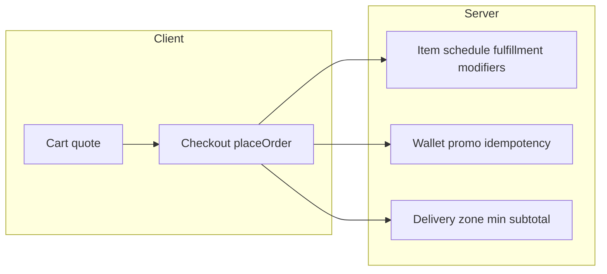
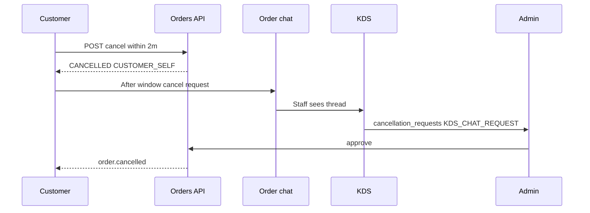

# PRD Point 8,12 Plan

Last updated: 2026-04-12

## Requested Wording (verbatim)

PRD §8 and §12 — requirements, status, and implementation backlog

Source note

The file Docs/Wings4U_PRD_v3_5_v24_FIXED.docx is not readable as plain text in the workspace. Section summaries and acceptance-style bullets below are taken from the repo’s existing PRD alignment write-up in .cursor/plans/wings4u-prd-7-and-11-kds-eta.plan.md (lines 123–186), which was built from that docx.

§8 — Validation rules and edge cases (PRD intent)

What the PRD expects (condensed):

Menu purchasability precedence: treat soft-delete / archive, inactive flags, is_available, schedules, fulfillment type, then “OK” — failures must be explicit errors, not silent drops.

Checkout revalidation: server-side checks for items, modifiers, builders (e.g. flavours/saucing), promo eligibility, schedule/lead time, prepayment gates, delivery zone (e.g. allowed postals), minimum subtotal.

Money-path safety: idempotency around wallet/promo side effects; wallet row locking or equivalent; atomic promo limit checks.

Cross-cutting edge cases (incl. §7.8.5): e.g. PIN failure audit visibility for ops.

Already implemented (verified in code)

Area

Evidence

Idempotency on checkout

apps/api/src/modules/checkout/checkout.controller.ts requires Idempotency-Key

Item is_available, fulfillment, schedules, modifiers, builders

apps/api/src/modules/checkout/checkout.service.ts (e.g. isAvailable, schedule violations, modifier validation loops)

Delivery minimum / eligibility

Same service + delivery helpers referenced in placeOrder

Student flag on order

Wired through checkout DTO / order create (see controller is_student_order)

Reorder revalidation

apps/api/src/modules/orders/orders.service.ts reorder() (PRD §7.4 / §8 cross-reference)

Gaps and concrete follow-ups for §8

archived_at / inactive catalog rows at checkout

MenuItem includes archivedAt. Checkout enforces isAvailable but does not reject lines when archivedAt != null (and there is no separate isActive on MenuItem — use isAvailable + archivedAt to match PRD precedence).
 Plan: In placeOrder, after resolving menuItem, if menuItem.archivedAt is set, return a structured 422/422 body consistent with other item errors. Mirror the same rule in cart quote if quote can still reference archived IDs.

Promo revalidation at placeOrder

Grep shows no promo application path in checkout.service.ts.
 Plan: Trace cart/quote → checkout; if promos exist only in quote, add transactional promo validation (valid window, limits, fulfillment, product targets) in the same transaction as pricing and persist redemption consistently.

Wallet concurrency (§8 row-level locking)

wallets.service.ts debit uses findUnique + update without SELECT ... FOR UPDATE.
 Plan: Use Prisma interactive transaction with tx.customerWallet.findUnique({ where: { customerUserId: userId } }) plus $queryRaw row lock or update with a conditional where: { balanceCents: { gte: amount } } and retry on failure; ensure checkout’s wallet application calls this inside the same transaction as order creation.

Delivery zone / postal validation

No allowed_postal / postal handling appears in checkout.service.ts.
 Plan: Parse address_snapshot_json for delivery, compare normalized postal code to location_settings.allowed_postal_codes (or equivalent), with clear errors.

Lead time (e.g. minimum 30 minutes)

Plan: Align LocationSettings defaults and web schedule/time-slot builders with PRD ranges; enforce no slot before now + minimum lead server-side on scheduled_for (same validation in quote if schedule is chosen there).

PIN failure audit

delivery-pin.service.ts logs PIN events to order_driver_events via logPinEvent, not admin_audit_logs.
 Plan: If PRD §8 / §7.8.5 requires admin_audit_logs, add a small write on mismatch (or mirror from driver events into admin audit with PIN_FAIL). If PRD only requires durable audit, document that driver events satisfy it.

§8 UI / QA matrix

Builder UX (modifier flows, flavour counts, saucing, tips delivery-only, etc.) needs a checklist pass on apps/web vs PRD table — no single file; treat as QA deliverable.

§12 — Cancel / Help / Contact (and related refund flows)

What the PRD expects (condensed from internal plan):

12.1 — Cancel within 2 minutes using cancel_allowed_until; after that, Help replaces Cancel; self-cancel sets CANCELLED + CUSTOMER_SELF and fixed reason copy.

12.2 — Help: specific copy + Contact us (phone / click-to-call).

12.3 — Chat-initiated cancel: operational flow with KDS_CHAT_REQUEST, link to chat_thread_id; admin approval.

12.4 — Admin/manager direct cancel (separate path).

12.5–12.6 — Admin Cancelled orders and Refund requests lists; paid cancel → auto refund_request when balance warrants.

Already implemented (verified)

Area

Evidence

2m window + cancel_allowed_until

Set in checkout; enforced in orders.service.ts customerCancel

Post-window: use chat/help

ConflictException message in customerCancel; order-detail-client.tsx surfaces chat

KDS cancellation request

kds.service.ts requestCancellation → requestSource: "KDS_CANCEL_REQUEST"

Admin approve/deny

admin.service.ts decideCancellation

Admin direct cancel

Admin API (see tasks / admin controller)

Gaps and concrete follow-ups for §12

Help + Contact (12.2)

Order detail does not expose a dedicated Help modal with PRD copy + tel: from location settings.
 Plan: Add Help entry (non-terminal, after cancel_allowed_until elapsed): modal with PRD strings; resolve store phone from API (location or menu payload) and tel: link.

KDS_CHAT_REQUEST + chat_thread_id (12.3)

CancellationRequest has no chat_thread_id. KDS only creates KDS_CANCEL_REQUEST.
 Plan: Migration: nullable chat_thread_id FK to order_conversations (or conversation id). New API path or parameter: e.g. staff “request cancel from chat” passes conversation_id → request_source = KDS_CHAT_REQUEST.

cancellation_source on approved requests (12.3 vs 12.4)

decideCancellation sets cancellationSource: "ADMIN" on approve (admin.service.ts lines 84–88). PRD expects KDS_CANCEL_REQUEST or KDS_CHAT_REQUEST on the order when the cancel came from that request type.
 Plan: Map request.requestSource → order.cancellationSource; keep cancelled_by_user_id = approving admin if PRD “Approved by” column requires it.

Fixed default reason for self-cancel (12.1)

Plan: In customerCancel, set cancellation_reason to PRD string (e.g. "Customer cancelled within window") regardless of optional client body, or only when body omitted.

Auto refund_request on paid cancel (12.6)

customerCancel does not call refund.service.ts.
 Plan: Central helper: on transition to CANCELLED, if net captured payment > 0, create PENDING refund_request idempotently (same pattern for admin/KDS-approved cancel).

Admin lists (12.5 / 12.6)

Plan: Add paginated GET endpoints for cancelled orders and refund requests; wire admin placeholder UI or successor with columns per PRD.

KDS UX for chat-sourced cancel

Plan: Extend KDS card actions + copy to include “customer requested via chat” when a conversation exists; call new chat-linked cancel path.

Suggested implementation order

§12 data model + correctness: chat_thread_id, cancellation_source mapping, default self-cancel reason, auto-refund hook — highest product risk for money and analytics.

§12 customer UX: Help modal + click-to-call.

§8 checkout hardening: archivedAt, postal zone, lead time, then wallet lock + promo atomicity.

§8 audit / QA: PIN audit destination if required; UI matrix.

Testing

E2E: Self-cancel sets reason string; after window, 409 and no cancellation_requests from customer path; approve KDS vs chat requests sets correct cancellation_source; paid cancel creates one pending refund request.  

Concurrency: Two parallel checkouts with same wallet credit (stress test) — no negative balance.  

§8: Archived item id in cart → checkout fails with clear error.

## Quick Summary

This note captures the PRD section 8 and section 12 follow-up backlog as a current issue-plan note.

In plain English, the remaining work falls into two buckets:

1. checkout hardening and validation edge cases that still need stronger server-side enforcement
2. cancel/help/refund flows that are partially implemented but still missing some PRD-required data wiring and customer/admin surfaces

This file preserves the exact requested wording above and then restates the same work in the repo’s standard issue-note format below.

---

## Purpose

This note explains:

1. what the PRD section 8 and section 12 backlog is
2. what is already implemented
3. what still needs to be fixed
4. what order the follow-up work should happen in

This is a planning note, not a fixed/archive note.

---

## How To Read This Note

If you want the short version, read:

- `Quick Summary`
- `Problem in plain English`
- `What was found`
- `What still needs to be fixed`
- `Final plain-English summary`

If you want the detailed planning view, read the whole note from top to bottom.

---

## Problem In Plain English

The repo already covers part of PRD section 8 and section 12, but not all of it.

The unfinished work is not one single bug.

It is a backlog of correctness gaps around:

- purchasability and checkout validation
- money-path safety
- delivery-zone and lead-time enforcement
- cancel/help/contact behavior
- refund-request automation
- admin and KDS cancellation tracking

So the real task is to close a set of PRD alignment gaps without breaking the flows that already work.

---

## Technical Path / Files Involved

The main files and modules named in the requested backlog are:

- [`apps/api/src/modules/checkout/checkout.controller.ts`](../../../apps/api/src/modules/checkout/checkout.controller.ts)
- [`apps/api/src/modules/checkout/checkout.service.ts`](../../../apps/api/src/modules/checkout/checkout.service.ts)
- [`apps/api/src/modules/orders/orders.service.ts`](../../../apps/api/src/modules/orders/orders.service.ts)
- [`apps/api/src/modules/kds/kds.service.ts`](../../../apps/api/src/modules/kds/kds.service.ts)
- [`apps/api/src/modules/admin/admin.service.ts`](../../../apps/api/src/modules/admin/admin.service.ts)
- [`apps/api/src/modules/wallets/wallets.service.ts`](../../../apps/api/src/modules/wallets/wallets.service.ts)
- [`apps/api/src/modules/delivery-pin/delivery-pin.service.ts`](../../../apps/api/src/modules/delivery-pin/delivery-pin.service.ts)
- [`apps/web/src/app/orders/[orderId]/order-detail-client.tsx`](../../../apps/web/src/app/orders/[orderId]/order-detail-client.tsx)
- `location_settings` / `address_snapshot_json` / cancellation request data model pieces referenced by the plan

There is also a QA pass implied on the web builder/cart experience rather than a single-file code change.

---

## Why This Mattered

These gaps matter because they sit on correctness-heavy paths.

If they are left incomplete, the system can drift from the PRD in ways that affect:

- whether archived or invalid catalog rows can still be purchased
- whether promo and wallet flows are safe under concurrency
- whether delivery scheduling and zone rules are actually enforced server-side
- whether cancel analytics and refund workflows reflect the true source of a cancellation
- whether customers get the intended Help / Contact behavior once the self-cancel window closes

This is not cosmetic work.

It affects order correctness, money safety, operations, and audit quality.

---

## What Was Found

### Already implemented

The requested backlog already acknowledges that some section 8 and section 12 behavior is in place:

- checkout requires `Idempotency-Key`
- checkout already revalidates item availability, fulfillment, schedules, and modifiers/builders
- delivery minimum / eligibility checks already exist in checkout flow
- student-order flag is already wired through checkout
- reorder already revalidates order lines
- the 2-minute self-cancel window already exists via `cancel_allowed_until`
- post-window customer cancel already routes users toward chat/help
- KDS cancellation requests and admin approve/deny paths already exist
- admin direct cancel already exists

### Remaining section 8 gaps called out by the backlog

- reject `archivedAt` catalog rows explicitly at quote/checkout
- add transactional promo revalidation at place-order time if promos are supported through quote
- harden wallet concurrency and atomic money-path behavior
- validate delivery postal / zone rules
- enforce scheduled lead time server-side
- decide whether PIN failure audit must also write to admin audit logs
- run a web builder/cart QA matrix against the PRD table

### Remaining section 12 gaps called out by the backlog

- add a proper Help + Contact modal with click-to-call
- support `KDS_CHAT_REQUEST` with `chat_thread_id`
- map approved cancellation requests back onto the order’s real `cancellation_source`
- normalize the default self-cancel reason string
- auto-create refund requests on paid cancels where appropriate
- add admin cancelled-orders and refund-request lists
- expose chat-sourced cancel context in the KDS UI

---

## What Still Needs To Be Fixed

### Section 8 plan

1. Checkout hardening for archived catalog rows
   Ensure quote and checkout both reject archived menu rows explicitly instead of relying only on `isAvailable`.

2. Promo revalidation inside checkout transaction
   If promo support exists, validate eligibility, limits, timing, and targets inside the same transactional money path as order creation.

3. Wallet concurrency hardening
   Replace simple read-then-update debit behavior with a transaction-safe pattern that prevents negative balances under concurrent checkout attempts.

4. Delivery zone and lead-time enforcement
   Validate normalized postal codes and enforce minimum lead time for `scheduled_for` on the server, not only in the web slot builder.

5. Audit and QA follow-up
   Decide whether PIN failure needs a mirrored admin audit destination and run the planned builder/cart QA checklist.

### Section 12 plan

1. Customer Help / Contact flow
   Add the Help modal and click-to-call behavior once the self-cancel window has elapsed.

2. Chat-linked cancellation requests
   Extend the data model and API so chat-sourced cancel requests are stored as `KDS_CHAT_REQUEST` and linked to the conversation.

3. Cancellation source correctness
   Make approved requests preserve the real request source on the order rather than flattening everything to `ADMIN`.

4. Self-cancel reason normalization
   Standardize the customer self-cancel reason string to the PRD expectation.

5. Auto refund-request creation
   Hook cancellation paths into idempotent refund-request creation when captured money exists.

6. Admin and KDS visibility
   Add the missing admin lists and KDS chat-cancel UX context.

---

## Files Expected To Change

If this backlog is implemented, the likely change set will involve some combination of:

- checkout controller / service
- orders service
- admin service
- KDS service
- wallets service
- refund service
- delivery-pin service
- cancellation request schema / migration files
- order detail UI
- KDS client UI
- admin UI endpoints and screens

The exact file list will depend on whether promo and wallet work already has hidden scaffolding elsewhere in the repo.

---

## Verification

This note is a planning note, so verification here means acceptance targets rather than completed proof.

The requested verification targets are:

- self-cancel reason string is correct
- post-window customer cancel does not create the wrong request type
- KDS vs chat-origin cancel requests preserve correct `cancellation_source`
- paid cancels create one pending refund request
- two concurrent wallet spends cannot drive the balance negative
- archived cart items fail checkout with a clear explicit error

---

## Status

Status: open planning backlog

The repo appears partially aligned already, but the follow-up items listed in the requested wording are still open until they are implemented and verified.

---

## Plain-English Takeaway

The main work left is not “build cancel from scratch” or “build checkout from scratch.”

The main work left is tightening the edges:

- stricter validation
- safer money handling
- more accurate cancel-source tracking
- better help/contact UX
- proper refund-request automation

That is the difference between “mostly works” and “matches the PRD safely.”

---

## Final Plain-English Summary

This file now does two things:

1. preserves your exact PRD section 8 / section 12 wording so the original requested backlog is not lost
2. restates that same backlog in the repo’s issue-note structure so it can be tracked, implemented, and later paired with a fixed note

The next implementation pass should follow the requested order:

- section 12 data-model and cancellation correctness first
- then section 12 customer Help / Contact UX
- then section 8 checkout hardening
- then section 8 audit / QA follow-up

---

## Appended Leftover Plan (verbatim)

PRD §8 / §12 — combined remaining work

This replaces/supersedes the scattered follow-up notes: one checklist for E2E (QA matrix) plus all other leftovers from the Phase 1–4 review.

Scaffolding: If you want test skeletons only (describe/it stubs, helpers, seed assumptions), ask to scaffold E2E in apps/api/test/app.e2e-spec.ts (and fix global-setup if tests still cannot start).

### 1. E2E tests — QA matrix (explicit TODOs)

These were still TODO; they are first-class backlog items (not optional polish).

| # | Scenario | Assert |
|---|----------|--------|
| 1 | Archived item reject | POST /checkout (or place-order path) with a line whose menu_item_id has archived_at set -> 422, clear message, field items |
| 2 | Postal zone reject | DELIVERY + allowed_postal_codes non-empty on location + address with bad postal_code -> 422, field address_snapshot_json.postal_code |
| 3 | Lead time reject | scheduled_for before now + prep (busy-aware) -> 422, field scheduled_for |
| 4 | Wallet concurrency | Same user, two checkouts that would overspend wallet -> first succeeds, second 422 insufficient wallet (or parallel race as feasible in CI) |
| 5 | Auto-refund on paid cancel | Order with net positive captured payments (order_payments SUCCESS sums) -> customerCancel or staff-approved cancel path -> PENDING refund_request, amount matches remaining net minus existing claims |

Bootstrap: If Jest global-setup / DB prevents runs, fix or document gate so CI can execute the suite (see historical note in wings4u-prd-7-and-11-kds-eta.plan.md).

Related doc: Docs/audits/prd-section-8-qa-matrix.md — update checkboxes when each E2E lands.

### 2. Chat lifecycle (non-E2E product fix)

After any path sets orders.status = CANCELLED, call ChatService.closeConversation(orderId) if not already:

- AdminService.decideCancellation (approve)
- AdminService.cancelOrder
- KdsService.handleCancelRequest (approve)

Then add/extend E2E: chat closed after admin/KDS-approved cancel (can merge with §1.5 flows).

### 3. Checkout edge case — salad archivedAt

When resolving saladCustomization.saladMenuItemId, reject if that menuItem.archivedAt is set (mirror main-line archived guard in checkout.service.ts).

### 4. Optional — refund idempotency

createForCancelledOrder: rare duplicate rows under concurrency — optional transaction lock or DB uniqueness for open refund pipeline per order.

### 5. Data / ops — prep minutes

Confirm seeds/production defaultPrepTimeMinutes (and busy) match PRD “30 min” language where required; QA matrix already flags default 20 in schema.

### 6. Deferred milestones (not blocking §8/§12 QA E2E)

- Promo in checkout: transactional redemption + usage_count when the feature exists.
- Admin lists: GET cancelled orders + refund requests + tables — separate milestone.

### Suggested order

- §1 E2E (including auto-refund on paid cancel) — locks behavior under CI.
- §2 Chat close — aligns product with existing chat lifecycle rules.
- §3 Salad archived — small server fix.
- §5 Seeds — quick alignment pass.
- §4 only if finance/compliance asks.
- §6 when scheduled.

## Appended Planning Summary

This appended section narrowed the remaining PRD section 8 / section 12 work to six concrete follow-ups:

1. land the missing checkout and cancellation E2E coverage
2. close chat on every cancel path that reaches `CANCELLED`
3. reject archived salad customization targets explicitly
4. harden refund auto-creation against duplicate rows under concurrency
5. align prep-minute defaults with the PRD baseline
6. leave promo-in-checkout and admin list work as deferred milestones

This is a continuation of the same issue, not a separate issue file. The later fixed-note appendix records which of these leftovers were actually completed and what verification was possible in the current environment.
